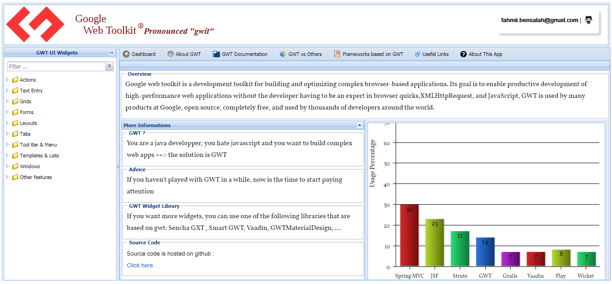

# GWT

GWT application is a demo application that highlights the strengths of the GWT frameworks and showcase its various UI widgets.

## Application Home Page 

 
 
## Getting Started

These instructions will get you a copy of the project up and running on your local machine for development and testing purposes. See deployment for notes on how to deploy the project on a live system.

### Installing

* Download the zip file "GWT-master.zip"

* Import the file into your workspace

* Add sencha GXT jars to your project's build path

* Launch the GWT compilation to your project

* Run 

## Built With

* [Maven](https://maven.apache.org/) - Dependency Management
 
## Authors

* **Fahmi Ben Salah** - *Initial work* - [GWT](https://github.com/BnSalahFahmi/GWT)

See also the list of [contributors](https://github.com/BnSalahFahmi/GWT/graphs/contributors) who participated in this project.
